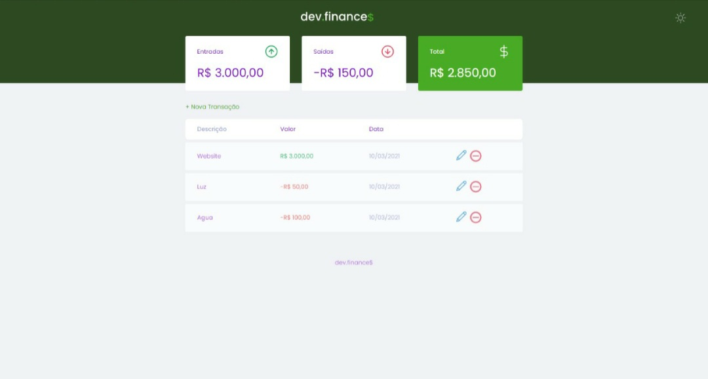

## 🛠 Technologies

This project was made using only the following technologies:

- [HTML](https://developer.mozilla.org/pt-BR/docs/Web/HTML)
- [CSS](https://developer.mozilla.org/pt-BR/docs/Web/CSS)
- [Javascript](https://developer.mozilla.org/pt-BR/docs/Web/Javascript)
  
## 💻 Project

Dev finance is a web system designed to help you control your finances.

## ⬆ Updates

This project is being the basis for my learning, so I make constant changes to it.

   ## 💡 Implementation ideas

    - [X] Add dark-mode and light-mode;
    - [X] Edit transactions;
    - [X] Confirm to remove an item;
    - [ ] Login system;
    - [ ] Improve responsiveness.

## ⬇ Installation

You will need [git](https://git-scm.com/) installed on your machine. Then, you can run the scripts below:

```bash
# Clone this repository
$ git clone https://github.com/Bruno-Ferr/Next-level-discovery

# Access the project folder in the cmd/terminal
$ cd dev-finances
```

## 🤔 How to contribute

1. Fork this repository;
2. Create a branch with your feature: **`git checkout -b my-feature`**;
3. Commit your changes: **`git commit -m 'feat: My new feature'`**;
4. Push to your branch: **`git push origin my-feature`**.

After the merge of your pull request is done, you can delete your branch.

Find a bug? Report it [here](https://github.com/Bruno-Ferr/Next-level-discovery/issues).

## 📝 License

This project is under the MIT license. See the archive [LICENSE](LICENSE.md) for more details.
